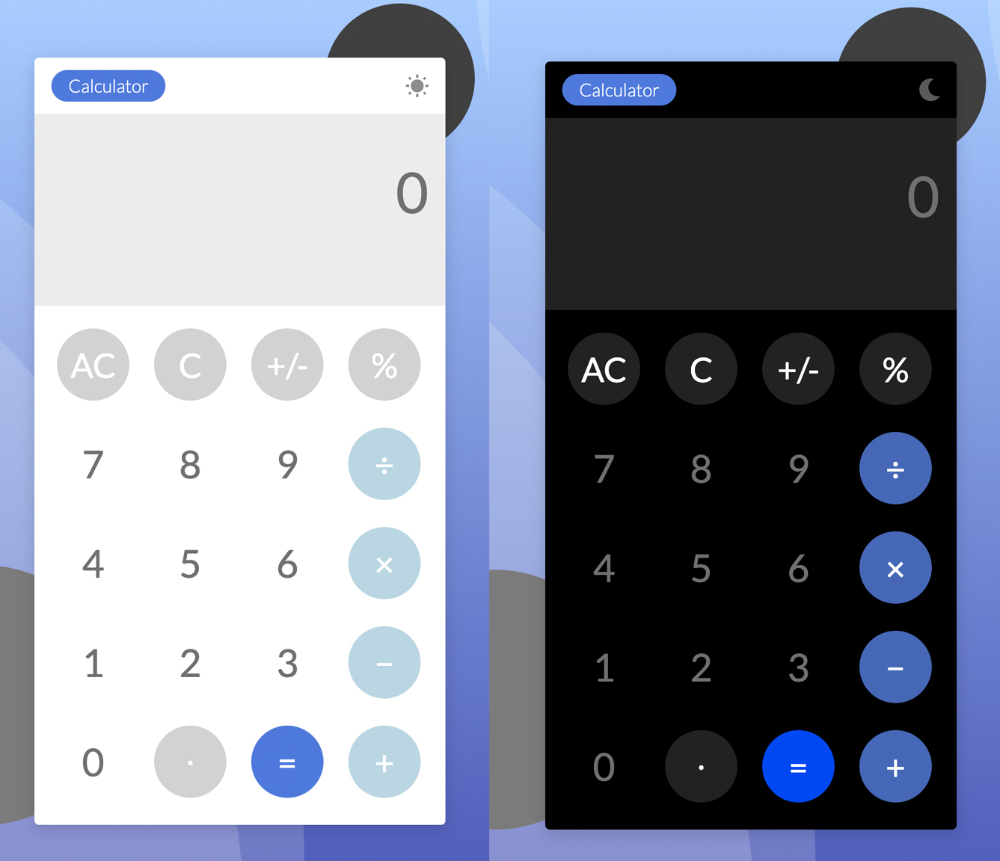

# Calculator App

- A basic calculator application including a dark theme.
- Front-end design from [BigsonDev](https://bigsondev.com/projects/calculator-app-project/).

### Concepts used

- ES6 object classes
- DOM Manipulation
- Ternary Operator
- CSS Grid
- Enabling Dark Mode

### Screenshots

### Pending

- If the page is refreshed while on Dark Mode, user needs to double-click icon to switch back to light mode.
